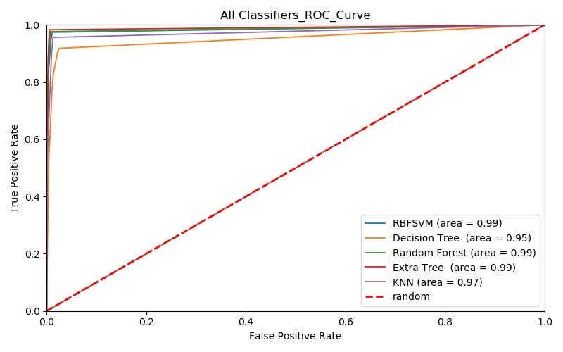

# Diagnosing Colorectal and Lung Cancer from Histopathological Images using Machine Learning

This project presents a **Computer-Aided Diagnosis (CAD)** system that detects and classifies **colorectal** and **lung cancer** from **histopathological images** using various supervised machine learning algorithms. The system aims to assist pathologists by increasing diagnostic accuracy and reducing time and effort.

## 📊 Project Overview

Cancer diagnosis using histopathology images is time-consuming and prone to human error. This project addresses those issues by automating the detection and classification process using machine learning. The system classifies 8 classes (5 colorectal, 3 lung) using a dataset of 40,000 images.

### 🎯 Objectives
- Build a CAD system to diagnose colorectal and lung cancer.
- Achieve high accuracy in classification using multiple ML algorithms.
- Provide a decision support tool for medical centers.

## 🧠 Algorithms Used
- **Support Vector Machine (SVM)** with RBF Kernel
- **Decision Tree**
- **Random Forest**
- **Extra Trees** (Best performing with 98.3% accuracy)
- **K-Nearest Neighbor (KNN)**

## 🗂️ Datasets Used
- **LC25000** (25,000 images, 768x768, 5 classes)
- **NCT-CRC-HE-100K** (100,000 images, 224x224, 9 classes, used 3 classes)

All images were resized to 224x224 and merged into a new dataset containing 8 classes with balanced representation.

## 🛠️ Feature Extraction
Features were extracted using:
- **Lower-Order Histogram**
- **Higher-Order Histogram**
- **Local Binary Pattern (LBP)**
- **Gray-Level Co-occurrence Matrix (GLCM)**

Total: **74 texture features** per image after preprocessing.

## 🔁 Model Pipeline
- Feature extraction → Normalization → PCA → Model Training
- **Cross-validation**: Repeated K-Fold (3x10 folds)

## 🧪 Performance
| Model           | Accuracy |
|----------------|----------|
| Extra Trees     | 98.3%   |
| SVM (RBF)       | 97.6%   |
| Random Forest   | 96.5%   |
| Decision Tree   | 94.8%   |
| KNN             | 93.4%   |

## 📷 Screenshots / Samples

### ROC Curve Comparison of All Classifiers



> This ROC curve visualizes the performance of all classifiers used in this project. The Extra Trees, SVM, and Random Forest classifiers achieved the highest AUC scores (≈ 0.99).

## 📦 Installation

```bash
git clone https://github.com/yourusername/colorectal-lung-cancer-ml.git
cd colorectal-lung-cancer-ml
pip install -r requirements.txt
```

## ▶️ How to Run

```bash
python main.py
```

Ensure that all dataset folders are in the correct directory structure.

## 📚 Future Work
- Incorporate deep learning (CNNs) for end-to-end learning
- Extend to other cancer types
- Improve feature extraction with color normalization

## 👨‍💻 Authors
- Awsan Ahmed Hassan Khaled  
- Emran Ali Abdullah Mohammed  
- Haneen Khaled Mohammed Mujahid  
- Hamzah Abdullelah Ali Mohammed  

**Supervisor**: Dr. Amer Sallam

## 📜 License
This project is for academic use. Contact the authors for permission to use datasets or methods commercially.
